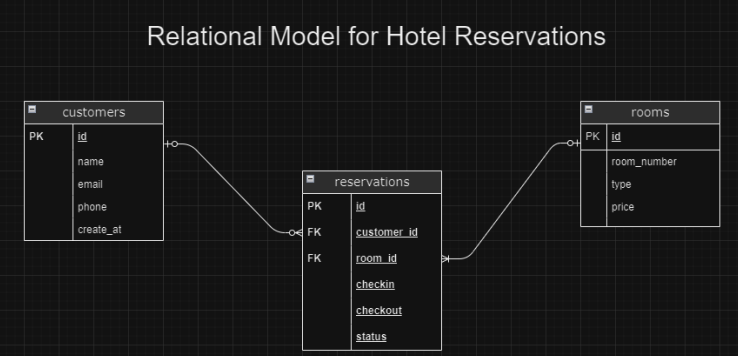
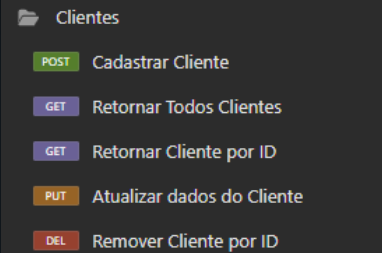
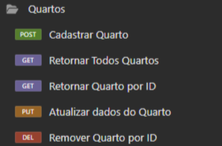
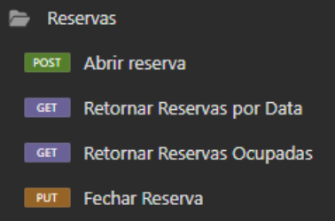

  <h1> Projeto Eclipse Hotel 🏨 </h1>

<h2 align="center"> Visão Geral do Projeto ✨ </h2>

<h3> Descrição: </h3>
O projeto Eclipse Hotel visa criar uma plataforma que permite o gerenciamento completo de reservas de quartos. O sistema será capaz de realizar operações CRUD para clientes, quartos e funcionalidades de abertura, encerramento e consultas de reservas.

<h3> Refinamento da Demanda: </h3>
Respondendo a pergunta feita durante o teste:
> Agora, pense que você está participando de uma cerimônia de refinamento desta demanda, e o Tech Lead condutor da dinâmica questiona o time se há alguma melhoria possível de ser realizada neste modelo, você sugeriria algum ajuste?

Modelo referido:
 

<h3> Resposta: </h3>
    -> Adicionar um campo para updated_at, em todas as tabelas, para sabermos quando a última alteração foi feita.
    -> Assim como um campo de created_at, para as tabelas de reservations e rooms.
    -> Adicionar um ENUM para os tipos de quarto, que acredito possuirem um padrão no hotel.
    -> Adicionar algum campo para registrar os pagamentos, se foram concluídos, se estão pendentes.
    -> Seria essencial criar uma nova tabela com um histórico de cada reserva feita, contendo todos seus status. 

<h3 align="center"> Endpoints 🔍 </h3>

<h3> Tecnologias Utilizadas: </h3>
    -> Backend: Spring Boot, Java 21, JPA e Hibernate
    -> Banco de Dados: PostgreSQL
    -> Insomnia para testar os endpoints

<h3> Contato: </h3>
Para mais informações ou dúvidas sobre o projeto, entre em contato com: 

 
  
 ✍🏾 liviafariabraz282@gmail.com 

    

